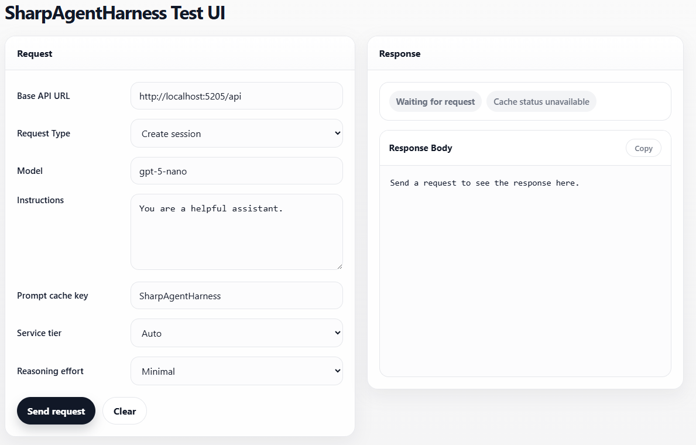
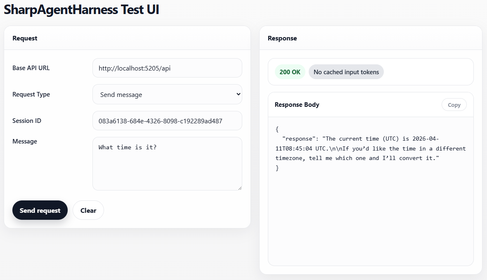
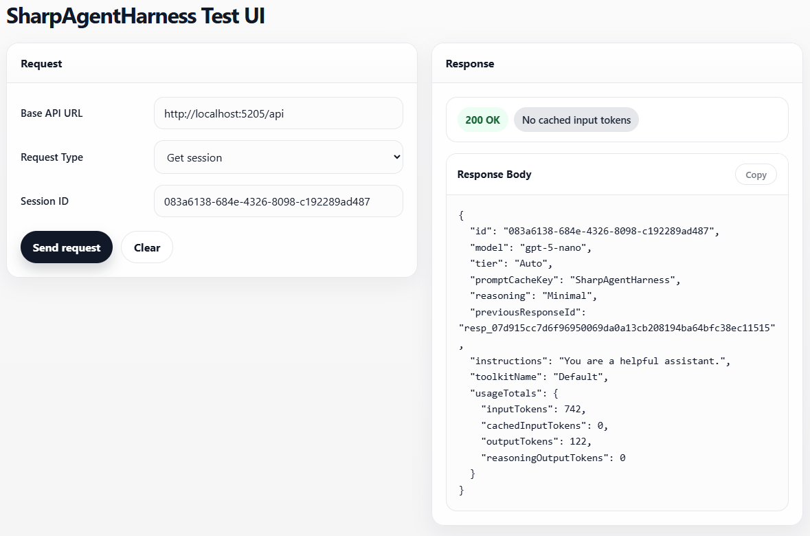
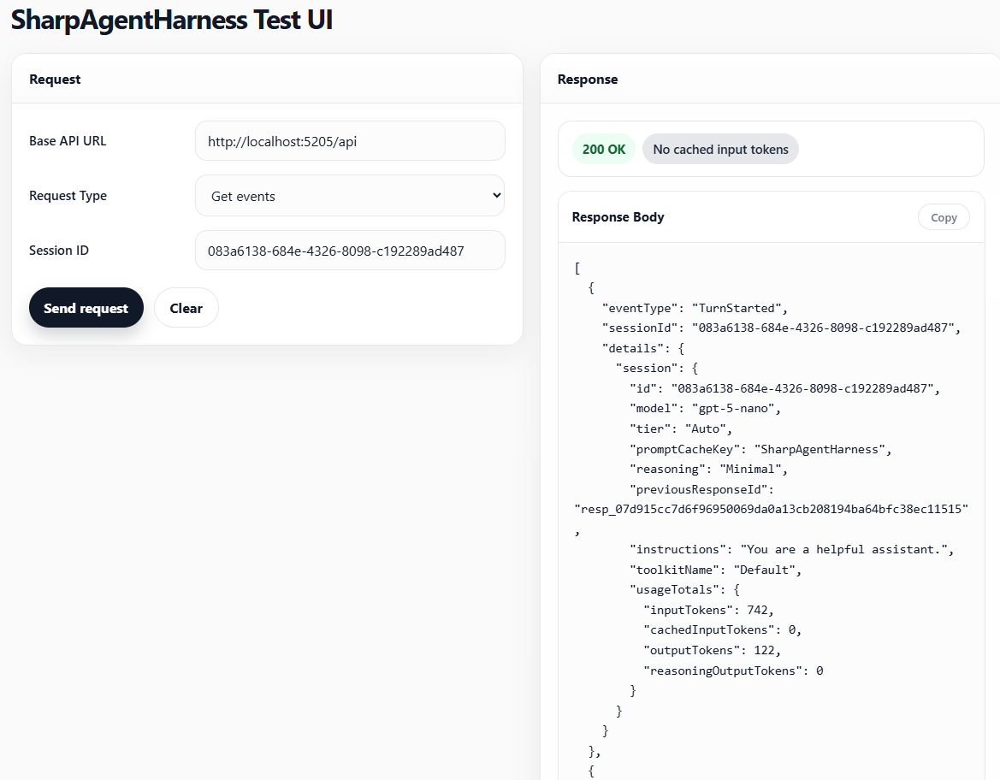

# Sharp Agent Harness

A minimal, general-purpose agent harness written in C#/.NET, providing a foundation for experimenting with the development of agents for business use.

## What’s Included

- A REST API for interacting with the agent harness.
- Support for function tools organised into named toolkits.
- Event tracing for visibility of session activity.
- A typed wrapper around a pragmatic subset of the Chat Completions API.
- A lightweight Web UI for interacting with the agent harness API.

## Project Structure

- `Agent` - Agent harness hosting the API (and Web UI for harness simplicity).
- `Tests` - A small set of integration-style tests that validate core aspects of harness behaviour.

## Architecture

- `Session` - manages the state of a single conversation with the agent harness.
- `Turn` - orchestrates a single turn within a `Session`, starting from a user message, handling any resulting tool calls and tool results, and returning the final output message.
- `Hook` - called at key points in the `Turn` lifecycle, enabling observation, mutation or abandonment of agent activities.
- `Event` - models session-scoped events used for tracing turn execution, LLM requests and responses, and tool activity.
- `ApiClient` - wraps communication with a Chat Completions-compatible API in terms of strongly typed `Request` and `Response` classes.

The repo also contains a `Tests` project with a small set of integration-style tests for verifying specific behaviours of the harness, such as prompt caching.  

## Design Choices

The harness takes an intentionally opinionated approach:

- Only a non-streaming subset of the CHat Completions API is currently supported.
- `Tools` are organised into named `Toolkits`.
- Each `Session` selects one `Toolkit` up front, and those tools are provided to the LLM on each turn.
- `strict` mode is always used for function tools, in line with OpenAI guidance.
- `prompt_cache_key` is used to improve the likelihood of prompt caching.
- Sessions and events are persisted in memory only.

These decisions were made to keep the harness small, focused, and easy to reason about while exploring agentic concepts.

## Running the Project

These instructions assume you have cloned and opened the repository in VS Code.

To run the harness locally you need:

- .NET 9 SDK.
- An OpenAI API key stored in the `OPENAI_API_KEY` environment variable.

In Visual Studio Code, Run > Start Debugging (or F5); you may be prompted to:

- Select Debugger (C#).
- Select Launch Configuration (Default).
- Select C# Startup Project (Agent).

This should start the ASP.NET application that serves the agent harness REST API and the lightweight Web UI. When running, use these local URLs:

- API health check: `http://localhost:5205/api` or `https://localhost:7000/api`
- Web UI: `http://localhost:5205/ui.html` or `https://localhost:7000/ui.html`

The UI defaults its base API URL to `http://localhost:5205/api`, so if you use the HTTPS endpoint instead, update that field in the page before sending requests.

## Example Flow

Using the Web UI:

### 1. Create a new session


### 2. Send a message to the session


### 3. Inspect the session


### 4. Inspect the event trace for the session


## API

Interaction with the agent harness is via a REST API served by the `Agent` application.

| Method | Route | Purpose |
| --- | --- | --- |
| `GET` | `/api` | Basic API health check. |
| `POST` | `/api/sessions` | Create a new session. |
| `GET` | `/api/sessions/{sessionId}` | Get the current state of a session. |
| `GET` | `/api/sessions/{sessionId}/events` | Get the event trace for a session. |
| `POST` | `/api/sessions/{sessionId}/messages` | Send a message to a session. |

### Endpoint Details

#### `GET /api`

Returns a simple success message that can be used to confirm the API is reachable.

Example response:

```json
"Hello from the SharpAgentHarness API!"
```

#### `POST /api/sessions`

Creates a new session. The request body is optional; omitted fields fall back to these defaults:

* `model`: `gpt-5-nano`
* `instructions`: `You are a helpful assistant.`
* `promptCacheKey`: `SharpAgentHarness`
* `tier`: `Auto`
* `reasoning`: `Low`
* `verbosity`: `Low`
* `toolkit`: `Default`

Example request body:

```json
{
  "model": "gpt-5-nano",
  "instructions": "You are a helpful assistant.",
  "promptCacheKey": "SharpAgentHarness",
  "tier": "Auto",
  "reasoning": "Minimal",
  "verbosity": "Low",
  "toolkit": "Default"
}
```

Example response body:

```json
{
  "id": "8c6d4e4f-3f64-4dbe-a474-f0df2a87c1d2",
  "model": "gpt-5-nano",
  "tier": "Auto",
  "promptCacheKey": "SharpAgentHarness",
  "reasoning": "Low",
  "verbosity": "Low",
  "instructions": "You are a helpful assistant.",
  "toolkitName": "Default",
  "usageTotals": {
    "inputTokens": 0,
    "cachedInputTokens": 0,
    "outputTokens": 0,
    "reasoningOutputTokens": 0
  }
}
```

If the requested toolkit does not exist, the API returns `400 Bad Request`.

#### `GET /api/sessions/{sessionId}`

Returns the current session for the given session ID.

If the session doesn't exist, the API returns `404 Not Found`.

#### `GET /api/sessions/{sessionId}/events`

Returns a list of events currently held in memory for the given session ID.

If the session doesn't exist, the API returns `404 Not Found`.

#### `POST /api/sessions/{sessionId}/messages`

Sends a user message to an existing session.

Example request body:

```json
{
  "message": "What time is it?"
}
```

Example response body:

```json
{
  "response": "The current time is ..."
}
```

If the session doesn't exist, the API returns `404 Not Found`.

## Current Limitations

This project is intentionally narrow in scope:

- Sessions and events are stored in memory only.
- Only a (non-streaming) subset of the Chat Completions API is supported.
- Tool selection happens on session creation, rather than dynamically per turn.
- Tests are minimal and focused on core aspects of harness behaviour.
- The `Agent` project also hosts the Web UI.

The project is designed as an experimental agent harness only, and is not suitable for production use.

## Possible Next Steps

Potential future explorations and improvements include:

- Experimental implementations of agentic concepts and tools relevant to business applications, such as memory, subagents, long-horizon tasks and Recursive Language Models (RLMs).
- Persistent storage for sessions and events.
- Authentication and rate limiting for the agent's API.

## License

This project is licensed under the MIT License - see the [LICENSE](LICENSE) file for details.

This is a personal experimental learning project provided "as is", without warranty of any kind.

## Contributions and Pull Requests

This repository is public for portfolio purposes only. Sorry, I'm not accepting contributions or pull requests at the moment.
